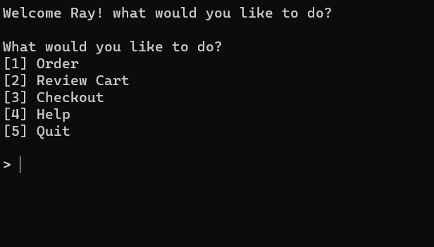

# Feed Me Terminal Application

███████╗███████╗███████╗██████╗░  ███╗░░░███╗███████╗██╗
██╔════╝██╔════╝██╔════╝██╔══██╗  ████╗░████║██╔════╝██║
█████╗░░█████╗░░█████╗░░██║░░██║  ██╔████╔██║█████╗░░██║
██╔══╝░░██╔══╝░░██╔══╝░░██║░░██║  ██║╚██╔╝██║██╔══╝░░╚═╝
██║░░░░░███████╗███████╗██████╔╝  ██║░╚═╝░██║███████╗██╗
╚═╝░░░░░╚══════╝╚══════╝╚═════╝░  ╚═╝░░░░░╚═╝╚══════╝╚═╝

# Links
## Github Repository Link

[Github Repository](https://github.com/rayves/Feed-Me-terminal-application)
## Purpose

### High Level Description 
The Feed Me! Terminal Application is an easy-to-use point-of-sale program for the fictional fast-food restaurant “Feed Me!”. The program will allow users to see the completely original menu for the restaurant and select the items they would like to order. All that needs to be done is for the customer to input their name, add their items to the virtual cart and confirm with payment. The result will be a receipt with their order, then the program can restart for the next customer.

### Why is this app being developed?
The Feed Me app is the starting point for a point of service terminal app project that will keep on evolving and could someday be used for back-end purposes for machine point of sale applications or online markets.

### Target Audience
FEED ME is aimed at anyone that wants an easy-to-use point of sale app that gets straight to the point and gives them what they need.

Having a simple interface and being easy to use, the app hopes to be accessibility to everyone, meeting their specific needs. Currently the app’s base features show that the app is operational and will complete its purpose in compiling orders selected and fulfilling those orders by way of a receipt with the order’s complete details. However, the app currently lacks quality of life functions such as:

- Ability to remove items from the cart;
- Ability to customise menu items; and 
- Accessibility for the visually impaired. 

These features are currently planned, and development and implementation will occur in an update sometime in the future or when the technology becomes available.

### How user can use this app
Customers can use the app by navigating through a simple interface which will display menu options to other features within the app. Customers can add FEED ME!’s menu items one by one and when they are ready proceed to payment, they will be prompted with the option to input a discount code which will be applied to their final order. Finally, they will be prompted to add a payment amount which if confirmed will process their payment and print a receipt with their customer number, order details and a message thanking them personally.

## Features & User interaction

### Customer name input 
   
For a personalized experience the program will ask for the users name which will be displayed with a welcome message if the name if confirmed.

   1. Upon starting the application the program will request the users name and the user must enter any name to continue.
   2. if no name is enter an error will be raised requesting a name in order to continue.

### Menu Options

Displays menu options to navigate between the various features.

  1. If 1 is selected the user will enter the Ordering Feature.
  2. If 2 is selected a table with the users 'cart' will display - showing the current items selected for order.
     1. If there are no items in the 'cart'. Message "Cart is empty will display"
  3. If 3 is selected a the user will enter the Checkout feature
     1. If there are no items in the 'cart'. Message "cart is empty will display" and prompt user to start ordering and add items to the cart in order to proceed.
  4. If 4 is selected a help message will display advising the user how the app works
  5. If 5 is selected quit feature will begin.
  6. If the user inputs anything but the above an error will occur advising they should input one of the menu numbers to proceed.

### Database Menu Items Display

Displays menu items for the user to choose and add to their order.

   1. The program imports in a csv with the name, description, price, and ingredients, and stores this information in an array waiting to be manipulated.
   2. The name, description and prices will then be displayed in a user friendly way in a table using the [Terminal Table](https://github.com/tj/terminal-table/) Ruby gem.

### Display Further Description of Menu
   
   This feature displays a description of each of the menu items that is selected by the user.

   1. Users once selecting Order will be prompted with a question asking if they would like to read further details on each of the menu items - describing the item with an overview of the ingredients.
   2. if 'yes' then they can input the numbers next to the items for a brief explanation of each.
   3. Once done they can input 'cancel' to return to the ordering menu where they will be prompted the same question whether they would like to read further details on each menu item
   4. if anything other than the above is entered an invalid input message will be display, then advising the correct input.

### Customer order selection 

This feature is where the ordering of items actually begins. Users select the item they wish to order by inputting the number next to the menu item and the item is added to the virtual 'cart'.

  1. After entering 'no' to wanting to see additional information on the menu items, the user can start selecting items they wish to add to their 'cart'.
  2. After selecting an item by inputting one of the numbers next to the item, said item will be added to the Users 'cart' and will display a message confirming so. The user will then be asked if they would like to order another time.
     1. yes or no inputs are accepted. All else triggers an instruction message.
  3. When the user has completed the ordering process by inputting no when prompted if they would want to order something else. The user will return to the main menu
### Orders Database 

The orders selected during the ordering process are added into the User's virtual 'cart' which is a hash that counts the number of specific items are being added.
This information is later referred to when displaying current order information in a table, calculating total cost of the order, and calculating reduction in total cost if a discount is applied.

### Deduction in Price With Specific Input

This feature allows users to apply a discount code which will reduce the total cost of the user's order. The discount code is applied by assigning a discount variable depending on what the user inputs which will be passed on to the final calculation, which is displayed during the payment process.

1. After the user has completed the ordering process they can enter the checkout process by selecting it from the menu input.
   1. If the user's cart is empty the user will not be able to enter the process and be advised they can only proceed once they start ordering.
2. After doing so they will be prompted with a request for a discount code if they have one, otherwise they can input no to proceed without a discount code.
   1. If the user enters "save the kids" promotional code, a 10% off discount will apply to the final order.
   2. If the user enters "employee discount", a 15% off discount will apply to the final order.
   3. If the user inputs anything else and error will occur advising they can only input an employee discount code, promotional code, or 'no'.

### Payment By Way of Input 

For this feature the user can input any amount which they would like to pay and the program will store that amount to display in the virtual receipt and advise them the difference being their change.

As the program cannot actually take payments, this is just a feature to showcase the program ability to make calculation and output that information in a stakeholder friendly way (Users seeing how much change they receive, Staff seeing if the user has paid, how much they have paid and how much change they received.)

1. The user, after the discount code process, will be asked to input the amount they wish to pay. The user must input an amount equal to or greater than the grand total amount (total order cost - discount) in order to proceed.
   1. If the user inputs an amount greater than the grand total then the difference, being change, will be displayed.
   2. if the user inputs an amount equal to the grand total then payment will be confirmed with no change.
   3. if the user inputs an amount less than the grand total then insufficient funds error will display advising that they must input an amount equal to or greater than the grand total amount.
   4. if the user enters nothing, a string, or 0 then an error will be raised advising that the input amount must be a number and cannot be 0.
   5. if the user enters a negative number than error will be raised advised invalid input and instruction displayed.

### Display Total Order With Items 

After the user has inputted a valid payment the order will be confirmed and a final receipt with all the order details including, quantity, ordered items, subtotaled prices, discount amount, payment amount, and grand total will be displayed under the restaurant title.

A final thank you message will be displayed confirming the order is being prepared.

### Export Final Order Receipt to File 

When the user gets through the final process above, the virtual receipt which is display at the end is also exported into a text file for record keeping purposes. Ideally the receipt will be automatically printed for the user and sent to the kitchen for preparation.

The file is created by using the unique customer id that is generated after the user inputs their name so new customers will all have different customer ids avoiding any overwriting of receipts.
### Features for future updates
#### Customer item removal

The ability for the user to remove an item from the 'cart' was originally planned however was removed due to time constraints as it is not absolutely essential as at this point the user can restart the app to start their order again. However this feature is a very important quality of life feature that would definitely provide the users with a more satisfied experience.

#### Menu item manipulation

Another quality of life feature would be to be able to change menu item ingredients as this would contribute significantly for accessability purposes, being able to cater to a wider range of users. However this feature was avoided as it is a quite complicated feature and with the time constraints would not be able to be fulfilled.
## Control Flow Diagram

### Original Sitemap

The original sitemap was created during the initial planning phase of the  development process. The menu item removal feature shown is later removed during the implementation process in the interest of time. The feature will be added in a future update.

The loop structure was also updated so that the display menu item description feature is contained within its own loop as to quickly display the description of the selected menu items. When the User is done looking at each of the items they can end the description loop and begin the ordering loop.

This change was so the interface behaves more like a menu where Users look at what the menu items are before they orde instead of asking about each item as they order.

This would improve user experience as well as they would not have to constantly input no if they do not want to know more about each item they are selecting to add to their 'cart'.

The discount portion of the sitemap operates in the same manner however its just be simplified for display.

The exit option was also added during the implementation process as the thought of what if a User walks into the restaurant, doesn't like what they see and walk out came up. So the exit option allows the user to cancel their order with no details being kept, so the next user can order.

### Updated Sitemap

## Implementation Plan

### Planning

Tracking of the implementation plan has been done through [Trello](https://trello.com/b/ahY5LGQu/feed-me-fast-food-app).
# Usage & Install Instructions

## Dependencies

### Ruby Version

This application requires ruby version 3.0.2 to execute.

You can check your version of ruby by executing the command below in your terminal

    $ ruby -v

If you do not have Ruby 3.0.2 version, please install this version. Instructions may differ for what ruby version management system you may be using Please visit the [Ruby](https://www.ruby-lang.org/en/documentation/installation/) website for your specific instructions.

The commands for `rvm` is displayed below.

    $ rvm install 3.0.2

After run the below command to check that you are currently using that version.

    $ rvm list

If not, you the below command to switch to this version.

    $ rvm use 3.0.2

### Gems

The dependencies are bundled within the bundle file which is generated using the [Bundle](https://github.com/rubygems/bundler) gem. Please install bundler if not already installed for the below commands to execute properly.

 From the `Feed-Me-terminal-application/src` directory execute the below command within the terminal to install bundle gem dependencies. 

    $ bundle install

Required Gemlist:
- [colorize](https://github.com/fazibear/colorize)
- [terminal-table](https://github.com/tj/terminal-table)
- [rspec](https://github.com/rspec/rspec-core)
- [artii](https://github.com/miketierney/artii)
- [CSV](https://github.com/ruby/csv)

## Program Execution

Option 1: Run the main file via terminal either by executing the file's entire PATH from root or from the `Feed-Me-terminal-application/src directory` directory

    $ ruby main.rb

Option 2: Run the bash script file from the terminal either by inputing its entire PATH from your devices root, or by navigating to the `Feed-Me-terminal-application/src directory` and executing the below command.

    $ ./feed_me.sh

# ARGV Arguments

The below commands will display a help message explaining how the app functions.

    $ ruby main.rb -help

The below command will show the menu available within the app.

    $ ruby main.rb show_menu

## Discount code

Within the program when prompted to input a promotional discount code or an employee discount code, the below inputs are the only valid inputs for a discount code.

### Promotional Discount Code

    $ save the kids

### Employee Discount Code

    $ employee discount

# Screens

